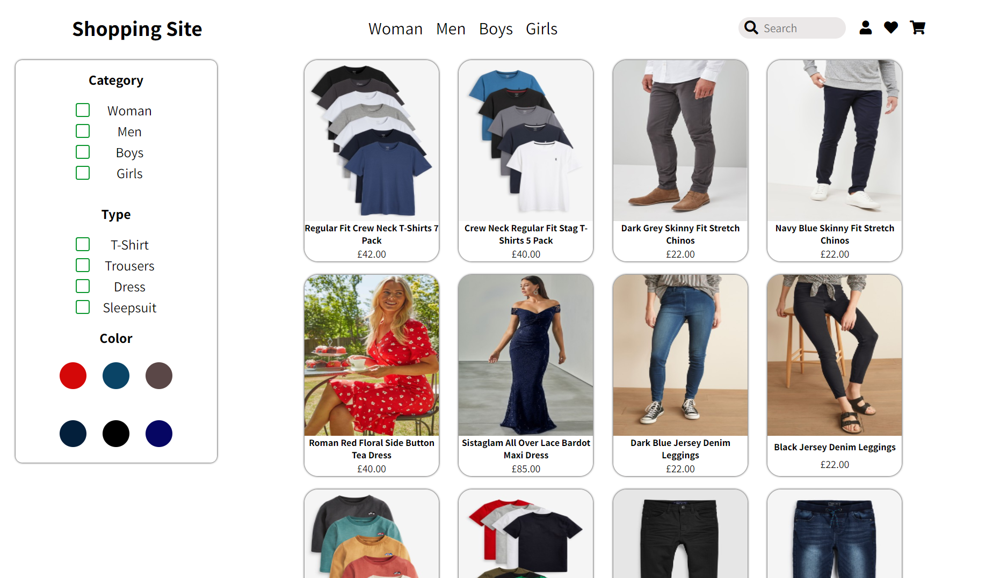
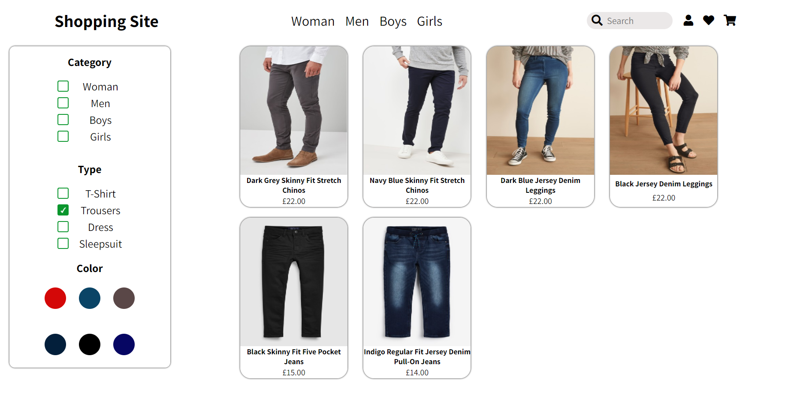

<h1 align="center">
Shopping Site Filter Project
</h1>

Fully responsive fake shopping website that allows you to filter through 'item-cards' by selecting a specific category, type or color. This is a personal project for my portfolio as a Web Developer.
#

## Table of contents
* [General info](#general-info)
* [Languages](#languages)
* [Features](#features)
* [Screenshots](#screenshots)
* [Todo](#todo)
* [Live Demo](#live-demo)

## General info

I created this project to showcase my ability to generate 'item cards' via data stored in JavaScript objects & using Template literals to display the data on each card. There is a filter box that has options to check to allow you to filter through that data to display specific 'item cards' for each filter selected.

	
## Languages

Project is created with:
* HTML5
* CSS3
* JavaScript ES6
* JavaScript Objects

## Features

* Cards generated via a JavaScript array of objects, to generate more cards automatically you can simply add another object to the array.
* Set filters allows you to filter and display only specific cards, the options are "Category", "Type" & "Color. 

## Screenshots

## Todo

- [ ] Add search bar functionality to search for items
- [ ] Option to add items 

## Live Demo

[Shopping Filter Website](https://shopping-filter-cg.netlify.app/)

	

